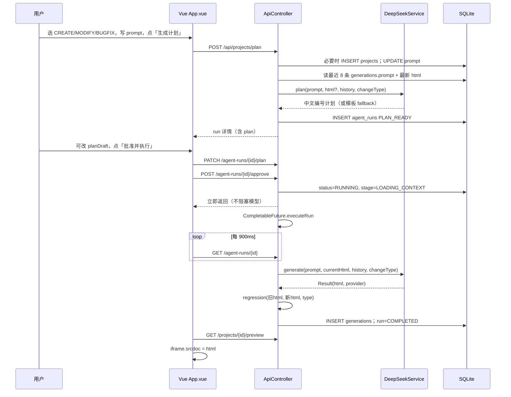

# Atoms Forge 架构设计文档

本文描述 Atoms Forge 的前后端架构、数据表、三条核心生成路径（创建 / 增量修改 / 修复 Bug），以及前端如何把 DeepSeek 产出的 HTML 变成可交互预览。实现以当前代码为准：后端 `ApiController` + `DeepSeekService`，前端 `frontend/src/App.vue`，表结构 `src/main/resources/schema.sql`。

---

## 1. 系统概览

Atoms Forge 是一个 AI 应用构建工作台：用户用自然语言描述产品，后端调用 DeepSeek 生成一份**独立可运行的单页 HTML**，在沙箱 iframe 中即时预览，并把每次产物作为不可变版本存入 SQLite。

主路径不是「点一下立刻出代码」，而是可观察的 Agent 流程：

```text
选变更类型 + 写需求
        ↓
   生成计划（DeepSeek.plan，不含代码）
        ↓
   用户审阅 / 编辑计划
        ↓
   批准执行（异步 DeepSeek.generate）
        ↓
   轮询阶段：LOADING_CONTEXT → GENERATING → REGRESSION → COMPLETED
        ↓
   iframe 预览新版本 + 结构回归结果
```

密钥只存在服务端（`DEEPSEEK_API_KEY`），永远不发给 Vue。

---

## 2. 前后端架构

### 2.1 分层

```text
┌─────────────────────────────────────────────────────────────┐
│  浏览器  Vue 3 + Vite（frontend/src/App.vue）                 │
│  · 认证、项目列表、composer、Agent 阶段条                      │
│  · iframe sandbox 预览（srcdoc = 生成 HTML）                  │
│  · 轮询 agent_runs，不直接调 DeepSeek                         │
└──────────────────────────┬──────────────────────────────────┘
                           │ REST  /api/*
                           │ Header: X-User-Id
                           ▼
┌─────────────────────────────────────────────────────────────┐
│  Spring Boot 4  ·  Java 25                                   │
│  ApiController     编排、鉴权、版本、Agent 状态机              │
│  DeepSeekService   OpenAI 兼容 chat/completions 适配器        │
│  SpaController     GET / → forward /index.html               │
│  WebConfig         开发期 CORS：5173 → 8080                   │
└──────────┬───────────────────────────────┬──────────────────┘
           │ JDBC                          │ HTTPS
           ▼                               ▼
     SQLite  atoms-demo.db         api.deepseek.com
     users / projects              /chat/completions
     generations / agent_runs      模型：deepseek-chat
```

| 层 | 技术 | 职责 |
|---|---|---|
| 前端 | Vue 3 + Vite | 三栏工作台：侧边项目、中间编排、右侧 Live Preview |
| 后端 | Spring Boot + JdbcTemplate | REST、归属校验、Agent 异步执行、ZIP 导出 |
| 模型 | DeepSeek `deepseek-chat` | 两阶段：先出中文计划，再出完整 HTML |
| 数据 | SQLite | 用户、项目、不可变 generations、可观察 agent_runs |

### 2.2 开发 vs 生产

**开发**

- 前端 `npm run dev` → `http://localhost:5173`
- Vite 把 `/api` 代理到 `http://localhost:8080`（见 `frontend/vite.config.js`）
- 后端 `WebConfig` 另开 CORS，允许 5173 直连 `/api/**`

**生产 / Docker**

- 多阶段构建：先编 Vue `dist`，再打 Spring JAR
- 同一进程托管：`GET /` 转发到 `index.html`，API 仍在 `/api`
- 数据文件默认 `./data/atoms-demo.db`，容器挂载 `/app/data`

### 2.3 请求身份

演示环境没有 JWT。登录成功后前端把 `{id,name,email}` 存 `localStorage`（键 `atoms-user`），之后每个 API 带：

```http
X-User-Id: <users.id>
Content-Type: application/json
```

后端用 `id + user_id` 查项目/任务，别人的资源一律 404，避免探测是否存在。

### 2.4 后端模块

| 类 | 角色 |
|---|---|
| `AtomsDemoApplication` | 启动入口 |
| `ApiController` | 全部 REST：认证、项目、预览/导出、Agent 三阶段 |
| `DeepSeekService` | 拼 prompt、调模型、失败回退 |
| `SpaController` | 根路径转 Vue |
| `WebConfig` | 开发 CORS |

前端**只走 Agent 路径**（`/projects/plan` → 编辑 → `/approve`）。同步接口 `POST /api/projects/generate` 仍可用（阻塞到模型返回），工作台 UI 当前不调用它。

---

## 3. 数据表结构

定义见 `src/main/resources/schema.sql`。启动时 `spring.sql.init.mode=always` 执行 `CREATE TABLE IF NOT EXISTS`。

```text
users 1 ──N projects 1 ──N generations
                 │
                 └── N agent_runs
```

### 3.1 `users` 账号

| 列 | 类型 | 说明 |
|---|---|---|
| `id` | INTEGER PK | 自增；前端当作 `X-User-Id` |
| `name` | TEXT | 显示名；空则默认 `Builder` |
| `email` | TEXT UNIQUE | 入库前转小写 |
| `password_hash` | TEXT | SHA-256 hex，无盐（演示用） |
| `created_at` | TEXT | ISO-8601 瞬时 |

### 3.2 `projects` 应用

| 列 | 类型 | 说明 |
|---|---|---|
| `id` | INTEGER PK | 项目 id |
| `user_id` | INTEGER | 所属用户 |
| `title` | TEXT | prompt 前 32 字 + `…` |
| `prompt` | TEXT | **当前**需求（每次计划/生成会覆盖） |
| `status` | TEXT | 见下表 |
| `created_at` / `updated_at` | TEXT | 时间戳 |

项目状态：

| status | 含义 |
|---|---|
| `PLAN_READY` | 计划已生成，等人批准 |
| `GENERATING` | 同步生成进行中（`/projects/generate`） |
| `READY` | 有可预览版本，或任务已取消/完成 |

### 3.3 `generations` 不可变产物

每次成功生成 **INSERT 新行**，不 UPDATE 旧 HTML。切换历史版本 = 按 `version` 读这一行。

| 列 | 类型 | 说明 |
|---|---|---|
| `id` | INTEGER PK | |
| `project_id` | INTEGER | 所属项目 |
| `version` | INTEGER | `MAX(version)+1`，从 1 起 |
| `prompt` | TEXT | **本版**对应的需求原文 |
| `html` | TEXT | 完整独立 HTML |
| `provider` | TEXT | 如 `DeepSeek · deepseek-chat` 或本地 fallback 原因 |
| `created_at` | TEXT | |

### 3.4 `agent_runs` 一次可观察任务

| 列 | 类型 | 说明 |
|---|---|---|
| `id` | INTEGER PK | 前端轮询用 |
| `project_id` / `user_id` | INTEGER | 归属 |
| `prompt` | TEXT | 本次需求 |
| `change_type` | TEXT | `CREATE` / `MODIFY` / `BUGFIX` |
| `plan` | TEXT | 可编辑实施计划 |
| `status` | TEXT | 任务状态机 |
| `stage` | TEXT | 细粒度阶段，驱动前端 01/02/03 |
| `trace` | TEXT | 多行中文进度，`\n` 拼接 |
| `regression` | TEXT | 完成后的 `STATUS: summary` |
| `result_version` | INTEGER | 成功时对应的 `generations.version` |
| `created_at` / `updated_at` | TEXT | |

**status**

```text
PLAN_READY → RUNNING → COMPLETED
                 ↓         ↗
             CANCELLED   FAILED
```

- `PLAN_READY`：可编辑计划、可批准、可取消
- `RUNNING`：后台 `executeRun`；只能协作式取消
- 终态：`COMPLETED` / `FAILED` / `CANCELLED`（再 cancel 幂等返回）

**stage（RUNNING 期间）**

| stage | 谁写入 | 前端阶段条 |
|---|---|---|
| `AWAITING_APPROVAL` | `plan` | 等待中 |
| `LOADING_CONTEXT` | `approve` | 01 理解需求 |
| `GENERATING` | `executeRun` | 02 设计页面 |
| `REGRESSION` | `executeRun` | 03 生成预览 |
| `COMPLETED` / `FAILED` / `CANCELLED` | 结束 | 全部完成或停止 |

---

## 4. Agent 总流程（前端 + 后端）

这是工作台实际走的路径。三种 `changeType` 共用此状态机，差别只在带给 DeepSeek 的上下文。



### 4.1 前端做什么 / DeepSeek 做什么

| 步骤 | 前端 | 后端 | DeepSeek |
|---|---|---|---|
| 写需求 | 收集 `prompt` + `changeType` + `projectId` | — | 不调用 |
| 生成计划 | `preparePlan()` POST `/projects/plan` | 建/更项目，读上下文 | **只出计划**，禁止出代码 |
| 改计划 | 本地 `planDraft` textarea | PATCH 覆盖 `agent_runs.plan` | 不调用 |
| 批准 | `approvePlan()` 后 `setInterval(refreshRun, 900)` | `runAsync(executeRun)` | **出完整 HTML** |
| 预览 | `iframe[srcdoc]` + `sandbox="allow-scripts allow-forms"` | 存 HTML、算回归 | 不调用 |
| 取消 | POST `/cancel` | 标 `CANCELLED`；生成结束后再读状态，不落库 | HTTP 无法强杀 |

前端**从不**把 API Key、当前 HTML 全文或历史需求自己拼给模型。它只传自然语言和变更类型。

### 4.2 协作式取消

Java 无法中断进行中的 DeepSeek HTTP。策略：

1. 取消接口立刻写 `status=CANCELLED`，项目拉回 `READY`
2. `executeRun` 在调模型**之前**和**之后**各读一次 status
3. 若已取消：**不 INSERT `generations`**，丢弃这次 HTML

---

## 5. 核心功能 1：创建应用（CREATE）

### 5.1 意图

从零生成一个可交互单页应用。没有「当前代码」可保留，历史需求为空。

### 5.2 入口条件

- 前端：`changeType === 'CREATE'`（新建应用按钮会强制设为 CREATE）
- 后端：`changeType` 缺省也当 CREATE；`CREATE` 或 `projectId == null` 都会 **INSERT 新项目**

### 5.3 算法

```text
1. 校验 prompt 非空
2. INSERT projects(user_id, title=截断prompt, prompt, status=PLAN_READY)
3. history = [] ，currentHtml = ""     // 创建路径刻意不读旧版本
4. DeepSeek.plan(prompt, "", [], "CREATE")
5. INSERT agent_runs(..., change_type=CREATE, status=PLAN_READY)
6. 用户批准后 executeRun：
     DeepSeek.generate(prompt, "", [], "CREATE")
     version = 1
     INSERT generations(html, provider, prompt)
     regression("", newHtml, "CREATE") → BASELINE
     projects.status = READY
```

创建模式下即使库里已有同用户其它项目，也**不会**把那些 HTML 喂给模型。

### 5.4 输入 / 输出

**前端 → 后端** `POST /api/projects/plan`

```json
{
  "projectId": null,
  "prompt": "做一个番茄钟，可开始/暂停，显示剩余时间",
  "changeType": "CREATE"
}
```

**后端 → DeepSeek（计划阶段）** 见 §8.1。创建时：

- `New request` = 用户 prompt
- `Historical requirements` = 空串
- `Current source exists` = `false`
- **不传 HTML 正文**

**DeepSeek → 后端（计划）**

```text
1. 设计番茄钟的页面结构（时间显示、开始/暂停按钮）。
2. 实现倒计时与按钮交互。
3. 生成完整可运行 HTML。
4. 完成后进行结构回归检查。
```

**后端 → 前端（计划）**

```json
{
  "id": 10,
  "project_id": 3,
  "status": "PLAN_READY",
  "stage": "AWAITING_APPROVAL",
  "plan": "1. ...",
  "trace": "已读取当前版本与历史需求\n已生成可编辑实施计划"
}
```

**批准后 DeepSeek 代码阶段输入** 见 §8.2。创建时：

- `Change mode: CREATE`
- `Prior requirements: No prior requirements.`
- `Current application source: No current source; create a new application.`

**DeepSeek → 后端（代码）**

- 期望：一份完整 HTML（可能包在 ` ```html ` 里）
- 后端清洗：去掉 ` ```html ` / ` ``` `，trim
- 存入 `generations.html`，`provider = "DeepSeek · deepseek-chat"`

**后端 → 前端（完成后）**

- 轮询得到 `status=COMPLETED`，`result_version=1`
- `GET /projects/3/preview` → `{ html, provider, version: 1 }`
- iframe 渲染该 html
- 回归：`BASELINE`（无旧版可比较）

### 5.5 无密钥 / 调用失败

`generate` 发现 key 为空或 HTTP 失败 → `fallback`：

- 创建场景 `currentHtml` 为空 → 本地 `demoHtml(prompt)`：深色卡片 + 计数按钮
- `provider` 标明 fallback 原因，评审仍能走通预览

---

## 6. 核心功能 2：增量修改（MODIFY，保留功能）

### 6.1 意图

在**已有应用**上加功能或改样式，禁止模型整页重写把旧功能丢掉。前端仅当已选中项目时才启用「增量修改」。

### 6.2 算法：「保留功能」靠三层约束，不是 Git diff

```text
1. 用户选 MODIFY，prompt 例如「加一个重置按钮」
2. POST /projects/plan { projectId, prompt, changeType: "MODIFY" }
3. 不新建项目（除非没带 projectId）
4. 加载上下文：
     history  = 最近 8 条 generations.prompt（按 version DESC）
     source   = 最新一版 generations.html
5. 计划阶段：告诉模型「已有源码 + 历史需求，必须保留未点名的功能」
6. 批准后 generate：
     把完整（截断后的）当前 HTML 塞进 user message
     明确：For MODIFY ... edit the current source instead of rebuilding it
           Preserve existing features, element IDs, forms, and interactions
7. INSERT 新 version（旧行不动，可随时切回）
8. regression(旧html, 新html, "MODIFY")
     按钮/表单/脚本数量不得减少，否则 WARN
```

「保留」是 **prompt 约束 + 历史需求列表 + 把旧源码原文交给模型 + 结构回归告警 + 失败则原样返回旧 HTML**。没有 AST 合并，也没有 DOM patch。

### 6.3 为什么带 8 条历史 prompt

模型只看见「加重置按钮」时，可能丢掉更早的「要筛选菜单」「要校验手机号」。把最近 8 条需求当作 MUST preserve 列表，降低遗忘。

历史查询：

```sql
SELECT prompt FROM generations
WHERE project_id=?
ORDER BY version DESC
LIMIT 8
```

### 6.4 输入 / 输出示例

**前端 → 后端**

```json
{
  "projectId": 3,
  "prompt": "加一个重置按钮，清空计时",
  "changeType": "MODIFY"
}
```

**组装给 DeepSeek.generate 的指令（逻辑摘要）**

| 字段 | 值 |
|---|---|
| Change mode | `MODIFY` |
| Current user request | `加一个重置按钮，清空计时` |
| Prior requirements | `- 做一个番茄钟…` 等最多 8 条 |
| Current application source | 当前 `index.html` 全文，最长 60_000 字符 |
| 额外约束 | 在现有源码上改；保留 element id、表单、交互，除非用户明确要求删除 |

**DeepSeek 输出**：仍是**一整份** HTML（不是 patch）。后端当新版本保存。

**失败保护**：`fallback` 若 `currentHtml` 非空 → **直接返回上一版 HTML**，provider 写 `previous version preserved`。增量失败不会变成空白页。

**回归**：例如旧版 2 个 button、1 个 script；新版若仍 ≥ 这些数量 → `PASS`；重置按钮应使 button 计数增加，仍为 PASS。

---

## 7. 核心功能 3：修复 Bug（BUGFIX）+ 结构回归

### 7.1 意图

修一个报出的错误行为，同时保证无关功能继续可用。前端 placeholder 示例：「手机号输入 abc 仍预约成功，请修复且不要影响菜单筛选。」

### 7.2 与 MODIFY 的相同点 / 不同点

| | MODIFY | BUGFIX |
|---|---|---|
| 必须有当前项目 | 是 | 是 |
| 带最近 8 条需求 | 是 | 是 |
| 把当前 HTML 给模型 | 是 | 是 |
| 禁止整页重写 | 是 | 是 |
| 额外指令 | 按需求改功能 | **只修报出的行为**，其它行为保持 working |
| 回归检查 | 同样跑 | 同样跑（UI 文案强调「执行回归检查」） |

`DeepSeekService.buildInstruction` 对两者共用一段 MODIFY/BUGFIX 约束，BUGFIX 多一句：

> For BUGFIX, fix the reported behavior and keep unrelated behavior working.

### 7.3 回归检查算法（后端，非浏览器测试）

实现：`ApiController.regression(before, after, type)` + `count(source, token)`。

**不是** Playwright/Selenium，不点击页面，不跑单元测试。它是一层**透明的结构启发式**：

```text
若 before 为空或空白：
    return { status: BASELINE, summary: "已创建首个版本；后续修改将进行结构回归检查。" }

否则：
    oldB = count(before, "<button")   // 故意不含 '>'，匹配 <button class="x">
    oldF = count(before, "<form")
    oldS = count(before, "<script")
    newB / newF / newS 同理扫 after

    pass = (newB >= oldB) AND (newF >= oldF) AND (newS >= oldS)

    PASS → "未发现核心结构减少"
    WARN → "请在预览中人工确认功能"
```

`count`：从下标 0 循环 `indexOf`，命中后下标 += token 长度。大小写敏感（`<BUTTON>` 不计）。

**判定含义**

| 结果 | 含义 | 前端 |
|---|---|---|
| `BASELINE` | 首版，无从比较 | 绿/中性提示 |
| `PASS` | 三类控件数量都未减少 | 可继续预览 |
| `WARN` | 至少一类变少（可能删了关键控件） | 提示人工看 iframe |

局限性（有意为之）：

- 把 `<button>` 改成 `<div role="button">` 会 WARN，即使功能还在
- 数量不变但 JS 逻辑坏了，检查发现不了
- 不解析 DOM，注释里的 `<button` 也会计数

Agent 完成后把结果压成一行存 `agent_runs.regression`：

```text
PASS: BUGFIX 结构回归：按钮 2→2，表单 1→1，脚本 1→1。未发现核心结构减少。
```

前端 `refreshRun` 用第一个 `:` 拆成 `{ status, summary }` 展示。

### 7.4 BUGFIX 输入 / 输出示例

**前端 → 后端**

```json
{
  "projectId": 3,
  "prompt": "手机号输入 abc 仍预约成功，请修复校验，不要影响菜单筛选",
  "changeType": "BUGFIX"
}
```

**DeepSeek.generate 关键句**

- Change mode: `BUGFIX`
- Current user request: 上述 bug 描述
- Prior requirements: 含「预约表单」「菜单筛选」等历史
- Current application source: 现有 HTML
- 约束：修报出的行为 + 保留 id/表单/交互 + 无关行为继续 working

**输出**：完整 HTML 新版本；回归比较修前/修后标签计数；用户在 iframe 里手工验证「abc 不能提交」且筛选仍可用。

---

## 8. 给 DeepSeek 的输入 / 输出（契约）

两次 HTTP 都打：

```text
POST https://api.deepseek.com/chat/completions
Authorization: Bearer ${DEEPSEEK_API_KEY}
Content-Type: application/json
```

响应统一取 JSON 路径 `/choices/0/message/content`。空 content 视为失败。

### 8.1 计划：`DeepSeekService.plan`

| | 值 |
|---|---|
| timeout | 30s |
| temperature | **0.2**（短、稳、少发挥） |
| messages | 单条 `role=user` |

**User content 模板（后端拼接）**

```text
Return only a concise numbered Chinese implementation plan (3-5 steps).
Do not generate code.
Change mode: {CREATE|MODIFY|BUGFIX}.
New request: {用户 prompt}.
Historical requirements: {history 用 " | " 拼接}.
Current source exists: {true|false}.
The plan must preserve unaffected features and include regression verification.
```

注意：计划阶段 **不发送 HTML 正文**，只发送是否存在源码的布尔值，降低延迟和 token。

**输出**：3–5 条中文编号步骤。空/异常 → 固定模板：

```text
1. 保留当前版本的既有功能和页面结构。
2. 根据本次需求实施 {changeType} 改动。
3. 生成完整可运行 HTML。
4. 比较按钮、表单和脚本，执行结构回归检查。
```

### 8.2 代码：`DeepSeekService.generate`

| | 值 |
|---|---|
| timeout | 55s |
| temperature | **0.7**（允许页面设计有变化） |
| messages | 单条 `role=user`（`buildInstruction`） |

**User content 结构**

```text
You are an expert product engineer.
Return ONLY one complete, safe, standalone HTML document
(inline CSS and JavaScript allowed).
Change mode: {type}. Current user request: {prompt}

Prior requirements (preserve them unless explicitly changed):
- {history 或 "No prior requirements."}

Current application source:
{html 前 60000 字，或 "No current source; create a new application."}

For MODIFY or BUGFIX, edit the current source instead of rebuilding it.
Preserve existing features, element IDs, forms, and interactions
unless the request explicitly removes them.
For BUGFIX, fix the reported behavior and keep unrelated behavior working.
```

**输出清洗**

```text
raw = choices[0].message.content
html = raw.replace("```html", "").replace("```", "").trim()
return Result(html, "DeepSeek · " + model)
```

**失败回退**

```text
currentHtml 非空 → Result(currentHtml, "Local fallback · previous version preserved: {reason}")
currentHtml 为空 → Result(demoHtml(prompt), "Local demo fallback ({reason})")
```

`demoHtml`：转义 `& < >` 后嵌入固定深色页 + `#progress` 点击计数，输出确定、可预览。

---

## 9. 前端：生成页面的逻辑

文件：`frontend/src/App.vue`（单文件工作台，无路由）。

### 9.1 界面分区

```text
┌──────────┬──────────────────────────┬─────────────────┐
│ aside    │ workspace                │ preview         │
│ 项目列表  │ composer（类型+prompt）   │ 流量灯 + iframe  │
│ 新建/删除 │ 阶段条 01–03              │ srcdoc 沙箱      │
│ 用户/退出 │ Agent Run 计划/trace     │                 │
│          │ 回归条 / 版本 / 代码 / 历史 │                 │
└──────────┴──────────────────────────┴─────────────────┘
```

### 9.2 页面生成时序（前端视角）

```text
preparePlan()
  POST /projects/plan { projectId, prompt, changeType }
  agentRun = 响应；planDraft = agentRun.plan
  重新 load + choose(project_id)，prompt 保持用户刚提交的原文

用户编辑 planDraft（可选）

approvePlan()
  PATCH /agent-runs/{id}/plan  { plan: planDraft }
  POST /agent-runs/{id}/approve
  watchRun()：立即 refreshRun，再每 900ms 轮询

refreshRun()
  GET /agent-runs/{id}
  若 COMPLETED：
      从 regression 字符串拆 status/summary
      load() + choose(project_id)
          GET /projects/{id}
          GET /projects/{id}/preview
          preview = preparePreview(html)
          iframe 绑定 :srcdoc="preview"

choose / version()
  切换历史版本同样走 /preview?version=N，只换 iframe，不调模型
```

`stageRank` 把 `agentRun.stage` 映射到阶段条：

| stage | rank | 条目标签（UI） |
|---|---|---|
| （无 / 等待批准） | 0 | 全部等待中 |
| `LOADING_CONTEXT` | 1 | 01 理解需求 |
| `GENERATING` | 2 | 02 设计页面 |
| `REGRESSION` | 3 | 03 生成预览 |
| `COMPLETED` | 4 | 三步都完成 |

标签是产品文案；真正「设计页面 / 写 HTML」发生在后端 `GENERATING` 调 DeepSeek 时。

### 9.3 预览安全与修补

```html
<iframe :srcdoc="preview" sandbox="allow-scripts allow-forms" />
```

- **有** `allow-scripts`：生成页里的按钮/计时器可运行
- **无** `allow-same-origin`：生成页拿不到父页面 localStorage / API
- `preparePreview(html)`：把本地 demo 里一种脆弱的 `onclick='n.textContent=...'` 换成 `getElementById`，避免 srcdoc 下标识符 `n` 不存在

前端**不解析、不编译**模型 HTML，只当字符串塞进 iframe。

### 9.4 其它前端职责（不经过 DeepSeek）

| 操作 | API | 说明 |
|---|---|---|
| 登录/注册 | `POST /auth/login` `register` | 结果写入 localStorage |
| 列表 | `GET /projects` | 侧边栏 |
| 看代码 | `GET /projects/{id}/code` | `text/plain`，可复制 |
| 导出 | `GET /projects/{id}/export` | 浏览器下载 ZIP（`index.html` + README） |
| 删除 | `DELETE /projects/{id}` | 先确认 |

ZIP 在服务端内存打包，README 只含 projectId / version / provider，**不含 API Key**。

---

## 10. 同步生成路径（API 存在，UI 未用）

`POST /api/projects/generate` 把「计划 + 批准 + 生成」压成一次阻塞请求：

1. 同样的项目创建规则与 8 条历史 / 当前 HTML
2. 直接 `deepSeek.generate`（跳过 plan）
3. INSERT generation，返回 `{ projectId, version, provider, trace[], regression }`

适合脚本/调试。工作台为了可编辑计划和可取消，走 Agent 路径。

---

## 11. 版本与产物生命周期

```text
CREATE 成功 → generations v1 （BASELINE）
MODIFY 成功 → generations v2 （与 v1 做结构比较）
BUGFIX 成功 → generations v3
用户点 v1   → GET preview?version=1 → iframe 换内容，库中三行都还在
导出 v2     → ZIP 只含该版 index.html
删除项目    → DELETE generations WHERE project_id；再 DELETE projects
```

版本号单调递增；取消的 run 不占 version。

---

## 12. 关键设计取舍

| 决策 | 原因 |
|---|---|
| 产物永远是单文件 HTML | iframe srcdoc 即可预览，无需构建前端工程 |
| 计划与代码分两次模型调用 | 人可以改计划；代码阶段贵且慢 |
| 增量靠 prompt + 旧源码，不做 patch | 实现简单；用回归 WARN + 保留旧版本兜底 |
| 回归只数三类标签 | 可解释、零依赖；不冒充完整测试 |
| 身份用 `X-User-Id` + SHA-256 | 控制 take-home 复杂度；文档与 README 均标明生产应换会话/Argon2 |
| 密钥只在服务端 | 防止浏览器泄露 `DEEPSEEK_API_KEY` |

---

## 13. 代码索引

| 主题 | 位置 |
|---|---|
| Agent HTTP 与状态机 | `src/main/java/dev/atomsdemo/api/ApiController.java` |
| DeepSeek 请求体 / fallback / demoHtml | `src/main/java/dev/atomsdemo/service/DeepSeekService.java` |
| 表结构 | `src/main/resources/schema.sql` |
| 前端编排与 iframe | `frontend/src/App.vue` |
| 开发代理 | `frontend/vite.config.js` |
| 配置与密钥注入 | `src/main/resources/application.yml` |
